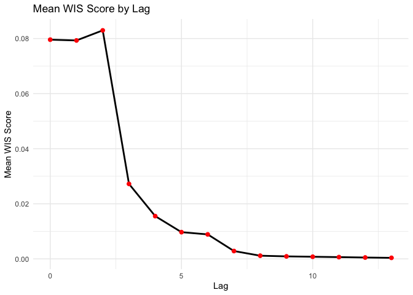
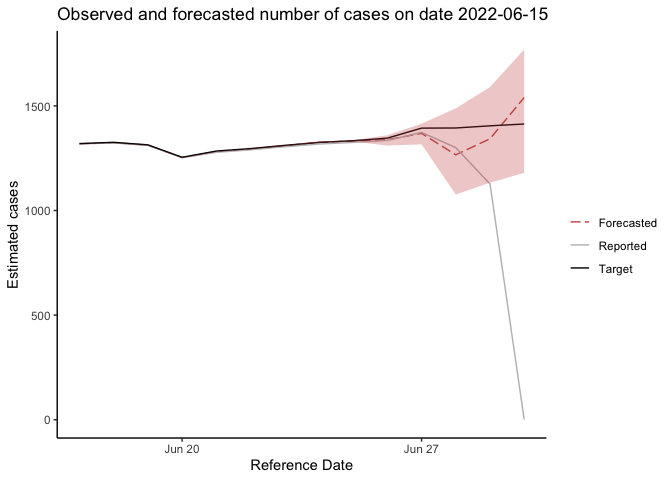

<!-- README.Rmd is used for generating README.Rmd. -->

# DelphiRF: Delphi - Revision Forecast

Delphi-RF is a nonparametric quantile regression framework designed to
correct real-time data revisions in public health surveillance. By
modeling revision dynamics and incorporating all available updates up to
a given observation date, Delphi-RF generates distributional forecasts
of finalized surveillance values for both count and fraction-based data.

##  Installation

You can install the package directly from GitHub using:

    devtools::install_github("jingjtang/DelphiRF")

If you have downloaded the package to a local directory, you can install
it with:

    install.packages("devtools")  # Install devtools if not already installed
    devtools::install("path/to/DelphiRF")  # Replace with the actual path

DelphiRF requires the **quantgen** R package and linear programming
solvers.  
Follow the installation instructions provided here: [quantgen GitHub
repository](https://github.com/ryantibs/quantgen).

## Data Preprocessing

`data_preprocessing` processes input data for DelphiRF, ensuring it is
structured correctly for modeling. Users are required to specify:

-   `df`: A **data frame** containing the input data  
-   `value_col`: A string indicating the column containing the observed
    values  
-   `refd_col`: A string indicating the column containing the reference
    dates  
-   `lag_col`: A string indicating the column containing lag values  
-   `ref_lag`: The reference lag used to align the forecast response
-   `suffixes`: A **character vector** specifying suffixes for generated
    value columns (default: `c("")`)
-   `lagged_term_list`: An optional **list** of lagged terms to include
    in preprocessing  
-   `value_type`: A string indicating the type of value (“count” or
    “fraction”) (default: “count”)
-   `temporal_resol`: The temporal resolution of the data, either
    `"daily"` or “weekly” (default: “daily”)
-   `smoothed`: A logical value (`TRUE`/`FALSE`) indicating whether the
    value column is alrealdy smoothed (default: FALSE)

For example, ma\_dph is a count-based dataset containing the 7-day
moving average of daily reported COVID-19 confirmed cases in MA.

    library(DelphiRF)
    library(ggplot2)
    data(ma_dph)
    tail(ma_dph)

    ##         test_date total_positive new_positive confirmed_case_7d_avg issue_date lag
    ## 257376 2022-07-14        1788698         1533              1470.286 2022-07-21   7
    ## 257377 2022-07-15        1790062         1364              1451.857 2022-07-21   6
    ## 257378 2022-07-16        1790912          850              1424.857 2022-07-21   5
    ## 257379 2022-07-17        1791840          928              1416.429 2022-07-21   4
    ## 257380 2022-07-18        1793065         1225              1329.286 2022-07-21   3
    ## 257381 2022-07-19        1793437          372              1122.714 2022-07-21   2

During the preprocessing step, the user would specify the following for
ma\_dph:

    value_col <- "confirmed_case_7d_avg"
    refd_col <- "test_date"
    lag_col <- "lag"
    ref_lag <- 14
    smoothed <- TRUE

The data is preprocessed using the following steps:

    # Preprocess the data for a specific location
    df <- data_preprocessing(
      ma_dph, 
      value_col = "confirmed_case_7d_avg", 
      refd_col = "test_date", 
      lag_col = "lag", 
      ref_lag = 14, 
      smoothed = TRUE
    )

    # Define the test date range
    test_dates <-  seq(from = as.Date("2022-06-15"),
                       to = as.Date("2022-06-30"),
                       by = "day")

    # Filter training data
    train_data <- df %>%
      filter(report_date < min(test_dates))

    # Add weighting-related features to training data
    # This should be done after the train_data is filtered with test_date
    train_data <- add_weights_related(train_data)

    # Filter test data
    test_data <- df %>%
      filter(report_date %in% test_dates)

## Model Training and Forecast Generation

### Running DelphiRF

To perform forecasting using `DelphiRF`, you need to specify:

-   `df`: A **data frame** containing the input data.  
-   `testing_start_date`: A **Date** object indicating the start date
    for testing (e.g., `as.Date("2022-06-01")`).

The function takes the entire revision dataset as input and
automatically divides it into multiple `test_lag_groups`, where each
group is assumed to have the same revision pattern. For each
`test_lag_group`, the function trains the model and generates forecasts
as needed using fixed hyperparameters.

    # Run DelphiRF for forecasting  
    results <- DelphiRF(df, as.Date("2022-06-01"))  

    # Compute mean WIS score for each lag
    mean_wis_by_lag <- results %>%
      group_by(lag) %>%
      summarise(mean_wis = mean(wis, na.rm = TRUE))

    # Compute mean WIS score for each lag  
    head(mean_wis_by_lag)  

    ## # A tibble: 6 × 2
    ##     lag mean_wis
    ##   <dbl>    <dbl>
    ## 1     0  0.0796 
    ## 2     1  0.0793 
    ## 3     2  0.0830 
    ## 4     3  0.0272 
    ## 5     4  0.0155 
    ## 6     5  0.00970

    # Plot using ggplot2
    ggplot(mean_wis_by_lag, aes(x = lag, y = mean_wis)) +
      geom_line(color = "black", linewidth = 1) +  # Line plot
      geom_point(color = "red", size = 2) +  # Add points
      labs(title = "Mean WIS Score by Lag",
           x = "Lag",
           y = "Mean WIS Score") +
      theme_minimal()  # Apply a clean theme

    visual_part <- results %>%
      filter(report_date == as.Date("2022-06-30")) %>%
      filter(reference_date >= as.Date("2022-06-10"))

    ggplot(visual_part) + geom_line(aes(reference_date, exp(predicted_tau0.5),col="Forecasted"), linetype="longdash") +
      geom_line(aes(reference_date, exp(log_value_7dav), col="Reported"),linetype="solid") +
      geom_line(aes(reference_date, exp(log_value_target_7dav), col="Target"),linetype="solid") +
      scale_colour_manual(name="",values=c("indianred3","gray", "black"))+
      theme_classic()+
      geom_ribbon(fill="indianred3",aes(x = reference_date,ymin=exp(predicted_tau0.25),
                                        ymax=exp(predicted_tau0.75)),alpha=0.3)+
      xlab("Reference Date") + ylab("Estimated cases") +
      ggtitle("Observed and forecasted number of cases on date 2022-06-15")

#### Optional Arguments

The user may optionally specify the following arguments: - `taus`: A
**numeric vector** of quantiles to be estimated (default: `TAUS`).  
- `test_lag_groups`: A **list** specifying the lag groups to be tested
(default: `TEST_LAG_GROUPS`).  
- `smoothed_target`: A **logical** value indicating whether the target
variable is smoothed (`TRUE`) or not (`FALSE`) (default: `TRUE`).  
- `lagged_term_list`: An **optional list** of lagged terms to include in
the model.  
- `params_list`: An **optional list** of parameters for model training
(more details in the create\_params\_list function in model.R).  
- `lambda`: A **numeric** value representing the regularization
parameter for the model (default: 0.1).  
- `gamma`: A **numeric** value representing the weight for the loss
function (default: 0.1).  
- `lag_pad`: A **numeric** value indicating the padding for lag
variables (default: 1).  
- `temporal_resol`: A **string** specifying the temporal resolution of
the data, either `"daily"` or `"weekly"` (default: `"daily"`).  
- `lp_solver`: A **string** indicating the linear programming solver to
be used (default: `LP_SOLVER`). - `training_days`: A **numeric** value
indicating the number of days to include in the training period
(default: `365`).  
- `train_models`: A **logical** value indicating whether to train models
(`TRUE`) or not (`FALSE`) (default: `TRUE`).  
- `make_predictions`: A **logical** value indicating whether to generate
predictions (`TRUE`) or not (`FALSE`) (default: `TRUE`).

#### Output File Naming Parameters:

These parameters define how output files will be named: - `geo`: A
**string** specifying the geographical location code (default:
`"ma"`).  
- `value_type`: A **string** indicating the type of the target variable,
either `"count"` or `"fraction"` (default: `"count"`).  
- `model_save_dir`: A **string** specifying the directory path where the
model will be saved (default: `"./receiving"`).  
- `indicator`: A **string** representing the indicator name for the data
(default: `"testdata"`).  
- `signal`: A **string** specifying the signal name associated with the
indicator (default: `""`).  
- `geo_level`: A **string** indicating the geographical level, such as
`"state"` or `"county"` (default: `"state"`).  
- `signal_suffix`: A **string** to be appended to the signal name
(default: `""`).  
- `training_end_date`: An **optional string** specifying the end date
for the training period (default: `""`).

### Generate a Revision Forecast for a Specific `test_lag_group`

This function trains a forecasting model and generates forecasts as
needed for a single `test_lag_group` using pre-filtered data. It is
utilized within the `DelphiRF` function.

Users can directly call the `revision_forecast` function if they assume
a consistent revision pattern in the given data. To use this function,
users must specify `train_data` and `test_data` separately.

    # Prepare training and test data for lag = 1  
    train_data_for_lag1 <- data_filteration(1, train_data, 0)  
    test_data_for_lag1 <- data_filteration(1, test_data, 0)  

    # Perform revision forecasting  
    result <- revision_forecast(
      train_data_for_lag1, test_data_for_lag1, TAUS,
      lambda = 0.1, gamma = 0.1,
      train_models = TRUE,
      make_prediction = TRUE
    )

    # Display the last few rows of the result  
    tail(result[c("reference_date", "report_date", "lag", "log_value_7dav", "log_value_target_7dav", "wis")])  

    ##    reference_date report_date lag log_value_7dav log_value_target_7dav        wis
    ## 11     2022-06-24  2022-06-25   1       0.000000              7.189599 0.04887828
    ## 12     2022-06-25  2022-06-26   1       0.000000              7.195723 0.05724033
    ## 13     2022-06-26  2022-06-27   1       7.036148              7.204893 0.04950035
    ## 14     2022-06-27  2022-06-28   1       7.029088              7.239830 0.05721481
    ## 15     2022-06-28  2022-06-29   1       6.992096              7.240342 0.05309328
    ## 16     2022-06-29  2022-06-30   1       7.027188              7.247691 0.05278094

    # Compute the mean WIS score  
    mean(result$wis, na.rm = TRUE)    

    ## [1] 0.05371732

Visualize the forecast result:

    ggplot(result) + geom_line(aes(reference_date, exp(predicted_tau0.5),col="Forecasted"), linetype="longdash") +
      geom_line(aes(reference_date, exp(log_value_7dav), col="Reported"),linetype="solid") +
      geom_line(aes(reference_date, exp(log_value_target_7dav), col="Target"),linetype="solid") +
      scale_colour_manual(name="",values=c("indianred3","gray", "black"))+
      theme_classic()+
      geom_ribbon(fill="indianred3",aes(x = reference_date,ymin=exp(predicted_tau0.25),
                                        ymax=exp(predicted_tau0.75)),alpha=0.3)+
      xlab("Reference Date") + ylab("Estimated cases") +
      ggtitle("Observed and forecasted number of cases at lag 1")

### Cross-Validation for Hyperparameter Tuning

The `cv_revision_forecast` function performs cross-validation over a
grid of hyperparameters for a single `test_lag_group` using pre-filtered
data. It returns the optimal set of hyperparameters that maximize
forecast accuracy.

    # Perform cross-validation to select optimal hyperparameters  
    hyperparams <- cv_revision_forecast(
      train_data, 1,
      lambda_candidates = c(0.01, 0.1, 1),
      gamma_candidates = c(0.1, 1, 10),
      lag_pad_candidates = c(0, 1, 2, 3),
      n_folds = 2
    )

    # Display selected hyperparameters  
    hyperparams  

    ## $best_lambda
    ## [1] 0.1
    ## 
    ## $best_gamma
    ## [1] 0.1
    ## 
    ## $best_lag_pad
    ## [1] 2

    # Training and Forecasting with Optimized Parameters
    # Prepare training and test data using optimized lag padding  
    train_data_for_lag1 <- data_filteration(1, train_data, hyperparams$best_lag_pad)  
    test_data_for_lag1 <- data_filteration(1, test_data, 0)  

    # Perform revision forecasting with optimized parameters  
    result <- revision_forecast(
      train_data_for_lag1, test_data_for_lag1, TAUS,
      lambda = hyperparams$best_lambda, 
      gamma = hyperparams$best_gamma,
      train_models = TRUE,
      make_prediction = TRUE
    )

    # Compute the mean WIS score  
    mean(result$wis, na.rm = TRUE)  

    ## [1] 0.05498269
